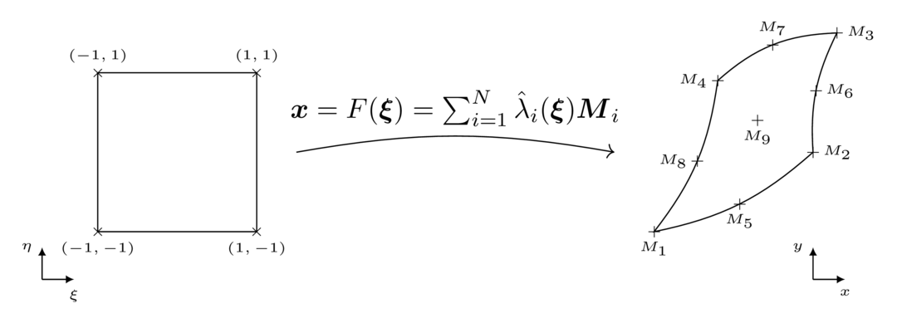

# Geometry and mesh

A `Mesh` is a set basically of nodes (`Node`), a set of entities (the mesh elements) and a list of connectivies that link the entities between themselves and with the nodes.

In Bcube every mesh entity has corresponding reference `Shape`, a simplified or canonical representation of this element. A 1D line is mapped on the $$[-1,1]$$ segment, and a rectangle is mapped on the $$[-1,1] \times [-1,1]$$ square for instance. On these reference shapes, (almost) everything is known : the vertices location, the area, the quadrature points... Hence in Bcube we always compute things in the reference shape. For "Lagrange" elements (such as `Bar*_t`, `Tri*_t`, `Quad*_t`, `Tetra*_t`, `Hexa*_t`, `Penta*_t` etc), the mapping from the reference shape to a geometrical element is directly obtained from the corresponding Lagrange polynomials and the element node coordinates. Given a geometrical element with `n` nodes `M_i`, the mapping reads:

```math
F(\xi) = \sum_{i=1}^n \hat{\lambda}_i(\xi)M_i
```

where $(\lambda)_i$ are the Lagrange polynomials whose order matches the element order.



Furthermore, an `AbstractDomain` is a subset of entities of the mesh. For instance, a `CellDomain` is a set of cells of the mesh, while `InteriorFaceDomain` and `BoundaryFaceDomain`are set of interior and boundary faces, respectively. This notion is a particular importance for integration and hence the definition of (bi)linear forms.


## Mesh generators

Bcube contains several helpers to build very simple mesh such as a line, a rectangle, a circle etc. The list of available mesh generators is available [here](@ref mesh-generator).

## Reading a mesh

To read a mesh from a file, use the `read_mesh` function from the [IO interface](@ref io-interface). However, there is no reader in the core of Bcube : there are implemented in companion packages.

For now, Bcube supports GMSH format (.msh) through the [BcubeGmsh.jl](https://github.com/bcube-project/BcubeGmsh.jl) package, and there is also partial support of the CGNS file format through the [BcubeCCGNS.jl](https://github.com/bcube-project/BcubeCGNS.jl) package.

```julia-repl
julia> mesh = read_mesh("mesh.msh")
```