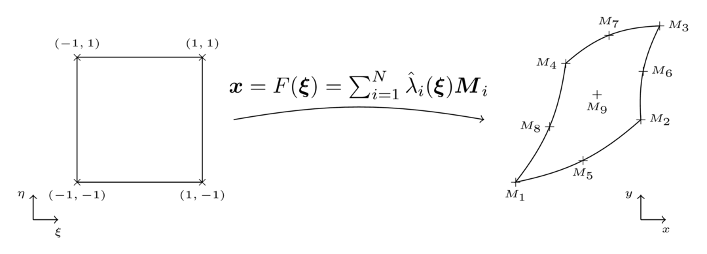

# Geometry and mesh

A `Mesh` is a set basically of nodes (`Node`), a set of entities (the mesh elements) and a list of connectivies that link the entities between themselves and with the nodes.

In Bcube every mesh entity has corresponding reference `Shape`, a simplified or canonical representation of this element. A 1D line is mapped on the `[-1,1]` segment, and a rectangle is mapped on a square for instance. On these reference shapes, (almost) everything is known : the vertices location, the area, the quadrature points... Hence in Bcube we always compute things in the reference shape. For "Lagrange" elements (such as `Bar*_t`, `Tri*_t`, `Quad*_t`, `Tetra*_t`, `Hexa*_t`, `Penta*_t` etc), the mapping from the reference shape to a geometrical element is directly obtained from the corresponding Lagrange polynomials and the element node coordinates. Given a geometrical element with `n` nodes `M_i`, the mapping reads:

```math
F(\xi) = \sum_{i=1}^n \hat{\lambda}_i(\xi)M_i
```

where $(\lambda)_i$ are the Lagrange polynomials whose order matches the element order.


